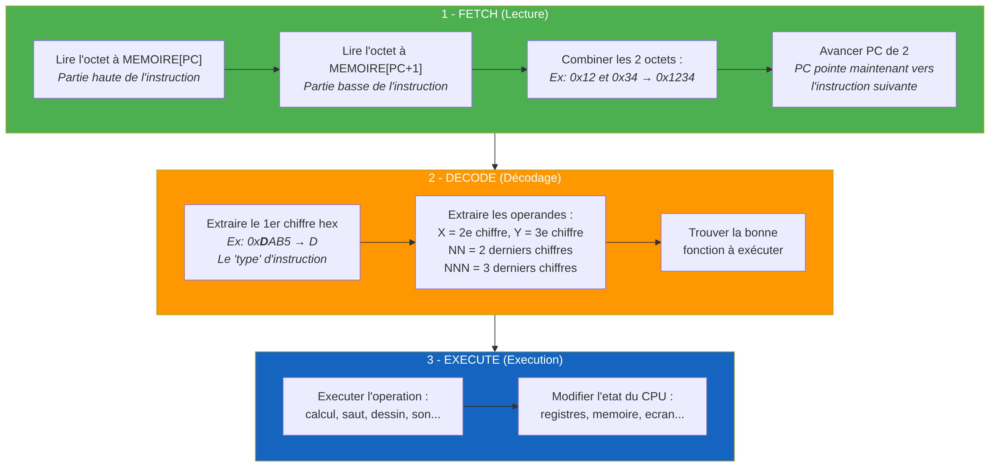
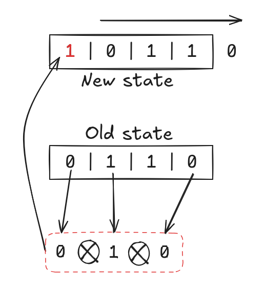

# Emulateur CHIP-8

Developpement d'un emulateur en assembleur x86-64

### Debrunbaix

---

## Sommaire

1. Qu'est-ce que le CHIP-8 ?
2. Architecture du projet
3. Choix techniques
4. Fonctionnement de l'emulateur
5. Quelques opcodes interessants
6. Fonctionnalitée suplémentaire.
7. Demonstration
8. Conclusion
9. Questions

---

# Qu'est-ce que le CHIP-8 ?

---

## Qu'est-ce que le CHIP-8 ?

<div class="columns">
<div>

- Langage interprété créé dans les **années 70**
- Conçu faire du developpement de jeu sur micro ordinateur.
- Résolution **64×32 pixels** monochromes
- **16 touches** d'entrée (0-F)
- **35 opcodes** (instructions de 2 octets)
- Utilisé sur : COSMAC VIP, Telmac 1800, HP-48

</div>
<div>


</div>
</div>

---

## Qu'est-ce que le CHIP-8 ? | Spécifications

<div class="columns">
<div>

- **Mémoire :** 4 Ko (4096 octets)
- **Registres :** V0-VF (16 × 8 bits)
- **Registre I :** 16 bits (adressage)
- **PC :** Program Counter (16 bits)
- **Stack :** 16 niveaux

</div>
<div>

| Zone | Adresse | Taille |
|------|---------|--------|
| Fontset | 0x000-0x04F | 80 o |
| Réservé | 0x050-0x1FF | 432 o |
| ROM | 0x200-0xFFF | 3584 o |

</div>
</div>

---

# Architecture du projet

---

## Architecture du projet | Arborescence

<div class="columns">
<div>

```
asm_chip_8/
├── Makefile
├── include/
│   ├── display.h
│   ├── audio.h
│   ├── input.h
│   └── timers.h
├── src/
│   ├── asm/
│   │   ├── main.s
│   │   ├── chip8_state.s
│   │   ├── cpu.s
│   │   ├── rom_loader.s
│   │   └── opcodes/ (21 fichiers)
│   └── c/
│       ├── display.c
│       ├── audio.c
│       ├── input.c
│       └── timers.c
└── roms/
```

</div>
<div>

| Fichier | Rôle |
|---------|------|
| *main.s* | Point d'entrée, boucle principale |
| *chip8_state.s* | État CPU, mémoire, fontset |
| *cpu.s* | Fetch des opcodes |
| *rom_loader.s* | Chargement ROM (syscalls) |
| *dispatcher.s* | Décodage et dispatch |
| *display.c* | Rendu Raylib |
| *audio.c* | Beep 440 Hz (sine) |
| *input.c* | Mapping clavier |
| *timers.c* | Timers 60 Hz |

</div>
</div>

---

## Architecture du projet | Vue d'ensemble

<div class="columns">
<div>

<div class="flow-group">
<div class="flow-group-title">Assembleur x86-64</div>
<div class="flow">
<div class="flow-box">main.s</div>
<div class="flow-arrow">↓ ↓ ↓</div>
<div class="flow-row">
<div class="flow-box">cpu.s</div>
<div class="flow-box">chip8_state.s</div>
<div class="flow-box">rom_loader.s</div>
</div>
<div class="flow-arrow">↓</div>
<div class="flow-box">dispatcher.s</div>
<div class="flow-arrow">↓</div>
<div class="flow-box">opcodes/</div>
</div>
</div>

</div>
<div>

<div class="flow-group">
<div class="flow-group-title">C + Raylib</div>
<div class="flow">
<div class="flow-box">display.c</div>
<div class="flow-arrow">↓ ↓ ↓</div>
<div class="flow-row">
<div class="flow-box">input.c</div>
<div class="flow-box">timers.c</div>
<div class="flow-box">audio.c</div>
</div>
</div>
</div>

<br>

**main.s** appelle les fonctions C via les conventions d'appel x86-64 (System V ABI)

</div>
</div>

---

# Choix techniques

---

## Choix techniques

<div class="columns">
<div>

**Assembleur x86-64 (NASM)**
- 20% ARM client (TechInsights)
- Plus compétent sur ce langage

**C pour le graphique**
- Interfaçage avec Raylib simplifié
- Gestion audio/input plus haut niveau

</div>
<div>

**Compilation**
- `nasm` -> objets `.o` (ASM)
- `gcc` -> objets `.o` (C)
- `gcc` link tout avec Raylib

</div>
</div>

---

# Fonctionnement de l'emulateur

---

## Fonctionnement | Cycle Fetch-Decode-Execute



---

## Fonctionnement | Fetch (cpu.s)

1. Lire **2 octets** depuis `MEMORY[PC]`
2. Combiner en opcode.
3. Incrémenter `PC += 2`
4. Vérifier `PC in [0x200, 0xFFE]`

---

## Fonctionnement | Decode (dispatcher.s)

<div class="columns">
<div>

Extraction du **premier index** 

| Nibble | Opcodes |
|--------|---------|
| 0 | 00E0, 00EE |
| 1 | 1NNN (Jump) |
| 2 | 2NNN (Call) |
| 6 | 6XNN (Set) |
| 8 | 8XY0-8XYE |
| D | DXYN (Draw) |

</div>
<div>

<div class="flow">
<div class="flow-box">opcode = 0xDXYN</div>
<div class="flow-arrow">↓</div>
<div class="flow-box">nibble = opcode >> 12</div>
<div class="flow-arrow">↓</div>
<div class="flow-diamond">nibble ?</div>
<div class="flow-arrow">↓</div>
<div class="flow-row">
<div class="flow-box">0x0 → CLS/RET</div>
<div class="flow-box">0x1 → Jump</div>
</div>
<div class="flow-row">
<div class="flow-box">0x8 → ALU</div>
<div class="flow-box">0xD → Draw</div>
</div>
<div class="flow-row">
<div class="flow-box">0xF → Misc</div>
<div class="flow-box">... → Autres</div>
</div>
</div>

</div>
</div>

---

## Fonctionnement | État CPU (chip8_state.s)

<div class="columns">
<div>

| Composant | Taille |
|-----------|--------|
| *MEMORY* | 4096 octets |
| *REGISTERS* | 16 octets (V0-VF) |
| *STACK* | 32 octets (16 × 16 bits) |
| *CH8_SP* | 1 octet |
| *PC* | 2 octets |
| *REG_I* | 2 octets |
| *KEYPAD* | 16 octets |
| *DELAY_TIMER* | 1 octet |
| *SOUND_TIMER* | 1 octet |
| *DISPLAY* | 256 octets |

</div>
<div>

**Initialisation `init_chip8` :**
- PC → 0x200
- Copie fontset en mémoire
- Efface registres, display, keypad
- Reset timers

```as
•••
xor rax, rax
mov rcx, 0x1000
lea rdi, [rel MEMORY]
rep stosb
•••
```

</div>
</div>

---

## Fonctionnement | Chargement ROM (rom_loader.s)

Chargement via **syscalls Linux**:

1. open() 
2. read() 
3. close() 

La ROM est chargée directement à l'adresse `MEMORY + 0x200`

---

## Fonctionnement | Boucle Principale (main.s)

<div class="columns">
<div>

```
./chip8_emu roms/tetris.ch8 FF0000
```

1. Parse arguments (ROM + couleur)
2. init\_chip8() → état CPU
3. rom\_loader() → ROM en mémoire
4. parse\_hex\_color() → couleur pixels
5. init\_display() → fenêtre Raylib
6. **Boucle** : 10 cycles + render
7. cleanup\_display() → fermeture

</div>
<div>


</div>
</div>

---

# Quelques opcodes interessants

---

## Opcodes | CXNN — Nombre aléatoire

<div class="columns">
<div>

- Algo LFSR
- X = Registre cible
- NN = masque

</div>
<div>



</div>
</div>

---

## Opcodes | 8XYx - Opérateurs arithmetiques.

<div class="columns">
<div>

- Premier bit (8) type d'opcode
- dernier bit (x) type d'opération arithmetique

</div>
<div>

```as
.check_8XYx:
    mov rax, r12
    and rax, 0xF

    •••

    cmp rax, 0x0
    je .do_8xy0
    cmp rax, 0x1
    je .do_8xy1
    •••
    •••
    cmp rax, 0xE
    je .do_8xyE
```

</div>
</div>

---

# Fonctionnalité suplémentaire.

---

## Changement de couleur des pixels

**Argument optionnel** au lancement :

```
./chip8_emu rom.ch8 F23838
```

- Couleur par défaut : **blanc** (0xFFFFFF)

</div>
</div>

---

# Demonstration

---

## Demonstration

```
./chip8_emu roms/games/tetris.ch8
./chip8_emu roms/games/pong.ch8 00FF00
./chip8_emu roms/games/space_invaders.ch8 F23838
```

---

# Conclusion

---

## Conclusion

<div class="columns">
<div>

**Réalisations :**
- Emulateur CHIP-8 fonctionnel
- Opcodes implémentés en ASM
- Affichage, son et input via Raylib
- Personnalisation couleur des pixels

</div>
<div>

**Difficultés :**
- Debug assembleur x86-64
- Interfaçage ASM / C
- Respect des conventions d'appel

**Améliorations possibles :**
- Implementation ARM sur raspberry avec vrai clavier.
- Interface de sélection de ROM

</div>
</div>

---

## Merci

#### Questions ?
